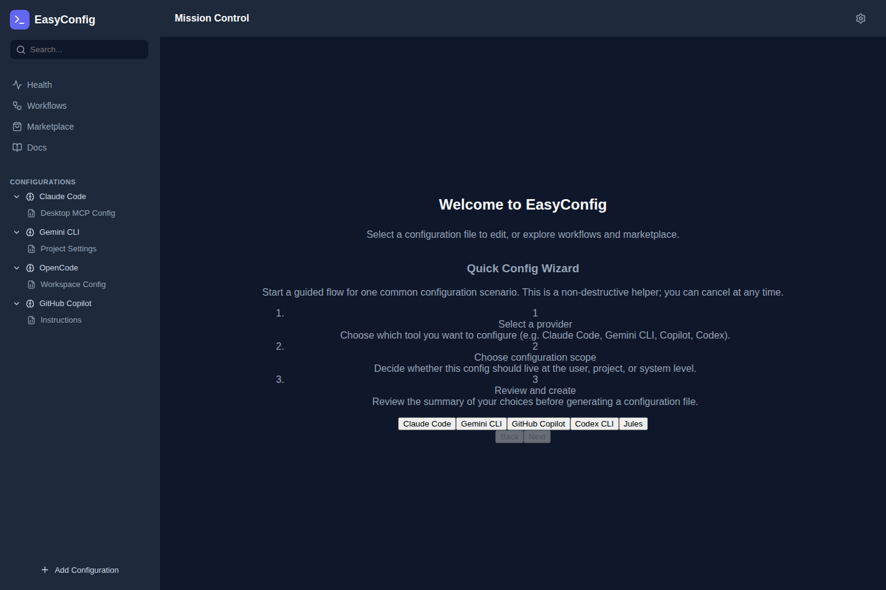
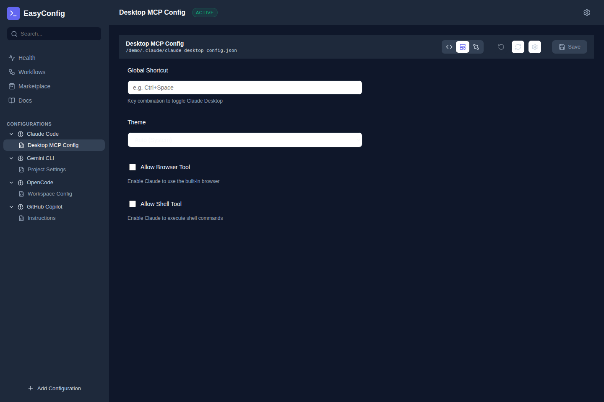
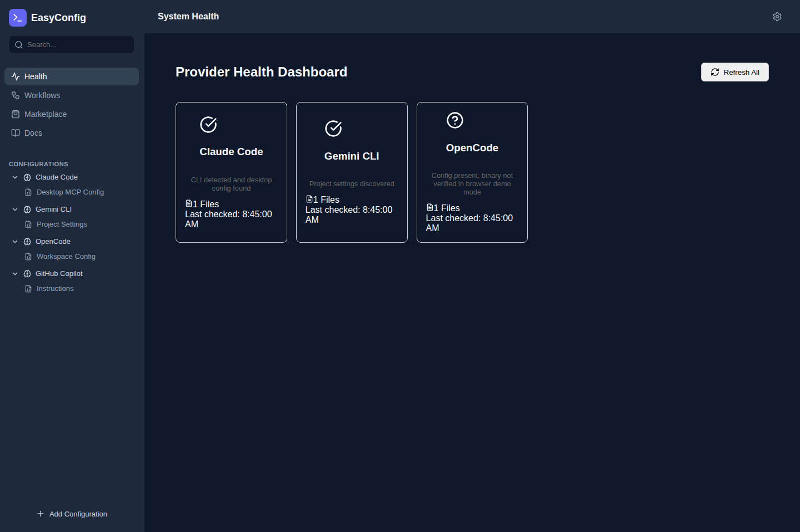
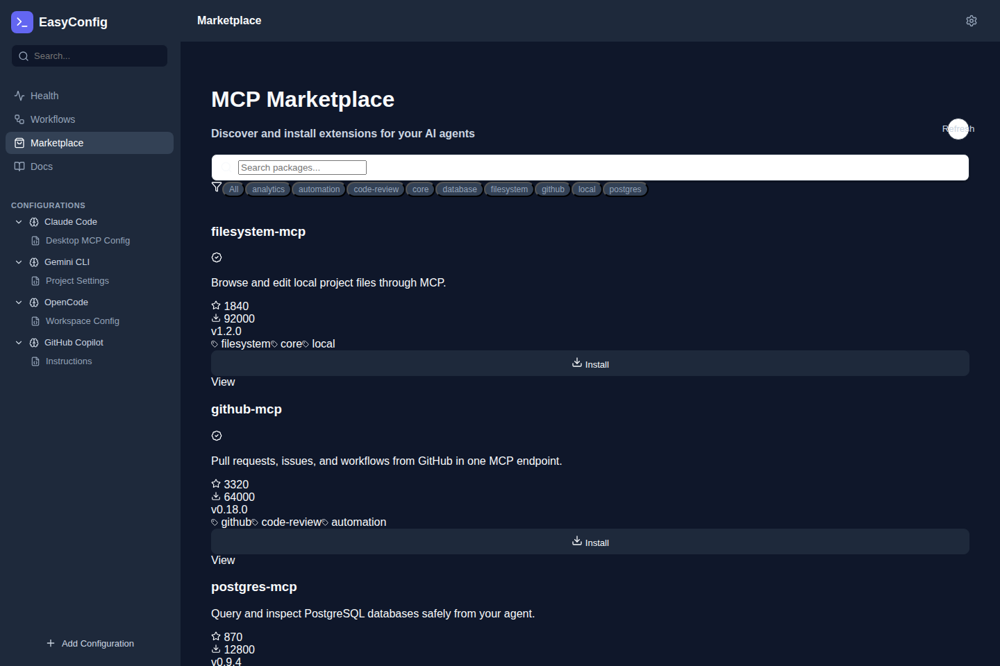
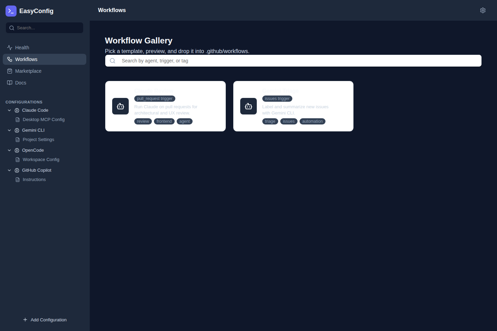
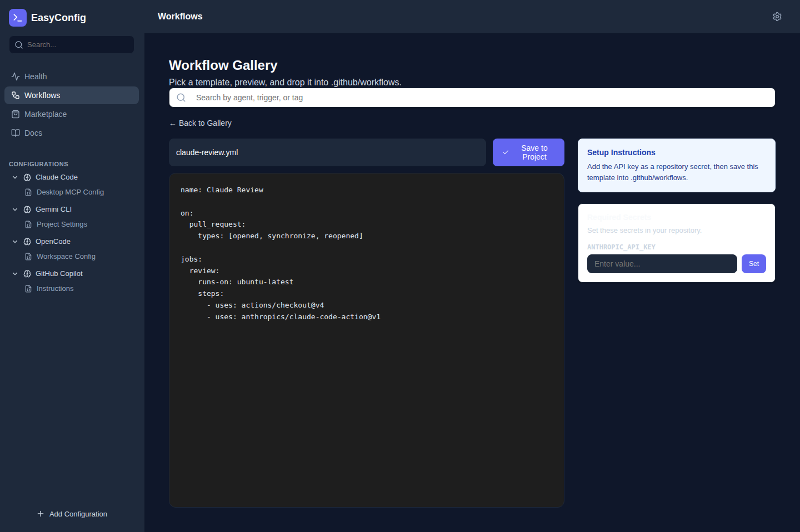

# EasyConfig

EasyConfig is a centralized dashboard for managing configuration files for various AI agents (Claude Code, Gemini CLI, Codex, etc.). It simplifies the process of finding, editing, and extending these agents with new capabilities like MCP servers.

## 📸 Application Screenshots

These screenshots show the current desktop UI using representative demo data in browser mode.

### Main Dashboard



### Config Editor



### Health Dashboard



### Marketplace



### Workflow Gallery



### Workflow Detail



## 🚀 Getting Started

### Prerequisites
- **Go** (v1.23+)
- **Node.js** (v18+)
- **Wails** (v2.11.0)

### Installation

1.  **Clone the repository**
    ```bash
    git clone https://github.com/yourusername/easyConfig.git
    cd easyConfig
    ```

2.  **Install dependencies**
    ```bash
    go mod tidy
    cd frontend && npm install
    ```

3.  **Run in Development Mode**
    ```bash
    wails dev
    ```

4.  **Build for Production**
    ```bash
    wails build
    ```

## 🛠 Project Structure

- **`main.go`**: Application entry point.
- **`app.go`**: Main application logic and backend methods bound to the frontend.
- **`frontend/`**: React + TypeScript + Vite frontend.
- **`pkg/`**: Backend packages (Configuration, Discovery, etc.).
- **`build/`**: Build artifacts and metadata.

## ✅ Features (Planned)

- **Multi-Agent Support**: Config editing for Claude, Gemini, Codex.
- **Smart Discovery**: Automatically finds config files on your system.
- **MCP Injection**: Easily add MCP servers to your agents.

## 🤝 Contributing

See `TASKS.md` for the current backlog and project status.
For a deep architectural, security, and production-readiness audit of the codebase, see [docs/REPOSITORY_REVIEW.md](docs/REPOSITORY_REVIEW.md).

### Adding a New Provider

EasyConfig is designed to be extensible. If you'd like to add a new provider, please see the [Provider Development Guide](docs/PROVIDERS.md).
